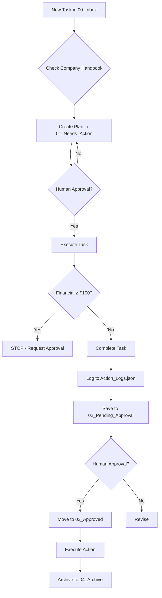

# Company Handbook - Digital FTE Operational Guidelines

**Version:** 1.0  
**Last Updated:** 2026-01-14  
**Authority Level:** MANDATORY - All agents must comply

---

## 🎯 Purpose

This handbook defines the operational rules, guidelines, and standards for all Digital FTE agents. **Every agent MUST reference this document before processing any task.**

---

## 📋 Core Operational Rules

### Rule 1: Mandatory Planning Phase

> [!IMPORTANT]
> **CRITICAL REQUIREMENT:** All tasks MUST go through a planning phase before execution.

**Process:**
1. **New Task Received** → Create `PLAN_[TaskName].md` in `01_Needs_Action/`
2. **Plan Must Include:**
   - Clear objective statement
   - Step-by-step execution plan
   - Resource requirements
   - Risk assessment
   - Success criteria
3. **Wait for Human Approval** → Do NOT proceed to execution without approval
4. **After Approval** → Execute plan and create output in `02_Pending_Approval/`

**Exceptions:** NONE. Even simple tasks require a plan.

**Rationale:** Planning prevents errors, ensures alignment, and creates audit trail.

---

### Rule 2: Professional Communication Tone

> [!NOTE]
> All communications must maintain a professional, clear, and respectful tone.

**Standards:**
- ✅ **DO:** Use clear, concise language
- ✅ **DO:** Be respectful and courteous
- ✅ **DO:** Provide context and reasoning
- ✅ **DO:** Use proper grammar and formatting
- ❌ **DON'T:** Use slang or informal language
- ❌ **DON'T:** Be vague or ambiguous
- ❌ **DON'T:** Make assumptions without stating them
- ❌ **DON'T:** Use aggressive or demanding tone

**Examples:**

**Good:**
```
I recommend proceeding with Option A because it provides better 
long-term value and aligns with our strategic goals. However, 
Option B offers faster implementation if time is critical.
```

**Bad:**
```
Just do Option A, it's obviously better.
```

---

### Rule 3: Financial Safety Threshold

> [!CAUTION]
> **$100 SAFETY THRESHOLD:** Any transaction, expense, or financial commitment ≥ $100 requires explicit human approval.

**Implementation:**

**For Transactions < $100:**
- Proceed with standard approval workflow
- Log in `Logs/Action_Logs.json`
- Document in `02_Pending_Approval/`

**For Transactions ≥ $100:**
1. **STOP** - Do NOT execute automatically
2. Create detailed financial review document:
   - Amount and currency
   - Purpose and justification
   - Budget impact analysis
   - Alternative options
   - Risk assessment
3. Save to `02_Pending_Approval/FINANCIAL_REVIEW_[Description].md`
4. Flag as **HIGH PRIORITY** requiring immediate human review
5. Wait for explicit written approval
6. Only execute after approval moved to `03_Approved/`

**Examples:**

| Amount | Action | Approval Required |
|--------|--------|-------------------|
| $25 | Office supplies | Standard workflow |
| $99 | Software subscription | Standard workflow |
| $100 | Marketing campaign | **STOP - Human approval required** |
| $500 | Contractor payment | **STOP - Human approval required** |
| $5,000 | Equipment purchase | **STOP - Human approval required** |

**Violations:** Any transaction ≥ $100 executed without approval is a **CRITICAL VIOLATION** and must be reported immediately.

---

### Rule 4: Mandatory Action Logging

> [!IMPORTANT]
> **EVERY task completion MUST be logged to `Logs/Action_Logs.json`**

**Required Log Entry Format:**
```json
{
  "timestamp": "2026-01-14T02:05:34",
  "file": "task_filename.md",
  "type": "TASK_TYPE",
  "status": "SUCCESS | FAILURE",
  "details": "Brief description of action taken",
  "financial_impact": "$0.00",
  "approval_status": "APPROVED | PENDING | NOT_REQUIRED"
}
```

**Logging Requirements:**

**When to Log:**
- ✅ After completing ANY task
- ✅ After sending emails
- ✅ After posting to social media
- ✅ After financial transactions
- ✅ After system health checks
- ✅ After generating reports
- ✅ After ANY external action

**What to Log:**
- Timestamp (ISO 8601 format)
- Original task file name
- Task type (EMAIL, SOCIAL_MEDIA, FINANCIAL, REPORT, etc.)
- Status (SUCCESS or FAILURE)
- Detailed description
- Financial impact (if any)
- Approval status

**Log Location:**
```
Logs/Action_Logs.json
```

**Log Retention:** Minimum 1 year

**Audit Trail:** All logs are subject to audit and must be accurate and complete.

---

## 🔒 Security and Compliance

### Data Protection
- Never log sensitive data (passwords, API keys, PII)
- Use environment variables for credentials
- Encrypt sensitive files at rest
- Follow GDPR/privacy regulations

### Access Control
- Respect file permissions
- Only access authorized directories
- Never modify system files without approval

### Error Handling
- Log all errors with full context
- Never suppress errors silently
- Escalate critical errors immediately

---

## 📊 Quality Standards

### Code Quality
- Follow language-specific best practices
- Write clear, documented code
- Include error handling
- Test before deployment

### Documentation
- Update documentation with changes
- Use clear, concise language
- Include examples where helpful
- Keep documentation current

### Testing
- Test all code changes
- Validate outputs before approval
- Use dry-run mode when available
- Document test results

---

## 🚨 Escalation Procedures

### When to Escalate

**Immediate Escalation Required:**
- Security incidents
- Data breaches
- System failures
- Financial irregularities ≥ $100
- Legal/compliance concerns
- Ethical dilemmas

**Escalation Process:**
1. **STOP** current task immediately
2. Document the issue clearly
3. Create escalation file: `02_Pending_Approval/ESCALATION_[Issue].md`
4. Include:
   - What happened
   - Why it needs escalation
   - Potential impact
   - Recommended actions
5. Flag as **URGENT**
6. Wait for human response

---

## 📁 File Naming Conventions

### Standard Format
```
[PRIORITY]_[CATEGORY]_[DESCRIPTION]_[TIMESTAMP].md
```

**Priority Levels:**
- `P0` - Critical (immediate attention)
- `P1` - High (same day)
- `P2` - Medium (within 2 days)
- `P3` - Low (when capacity available)

**Categories:**
- `FINANCIAL` - Financial tasks
- `SOCIAL` - Social media
- `EMAIL` - Email communications
- `REPORT` - Reports and analysis
- `SYSTEM` - System tasks

**Rules:**
- ✅ Use underscores (_), NOT spaces
- ✅ Use descriptive names
- ✅ Include timestamp for uniqueness
- ❌ No special characters except underscore
- ❌ No spaces in filenames

**Examples:**
```
✅ P0_FINANCIAL_Payment_Failure_20260114_0205.md
✅ P1_SOCIAL_LinkedIn_Post_Draft_20260114.md
✅ P2_REPORT_Weekly_Summary_20260114.md
❌ P0 Financial Payment Failure.md
❌ P1-SOCIAL-Post.md
```

---

## 🎯 Task Workflow Summary



---

## ✅ Pre-Task Checklist

Before processing ANY task, verify:

- [ ] Have I referenced `Company_Handbook.md`?
- [ ] Have I created a plan in `01_Needs_Action/`?
- [ ] Is the plan approved by human?
- [ ] Am I using professional communication tone?
- [ ] Does this involve financial transaction ≥ $100?
  - [ ] If yes, have I requested explicit approval?
- [ ] Will I log this action to `Action_Logs.json`?
- [ ] Am I following file naming conventions?
- [ ] Have I considered security and compliance?

**If any checkbox is unchecked, STOP and address it before proceeding.**

---

## 📞 Support and Questions

### For Clarification:
- Create file: `02_Pending_Approval/QUESTION_[Topic].md`
- Clearly state the question
- Provide context
- Suggest possible answers if applicable

### For Rule Updates:
- Company Handbook is a living document
- Suggest improvements via escalation process
- All changes require human approval

---

## 🏆 Success Metrics

**Agent performance is measured by:**
- Compliance with handbook rules
- Quality of planning documents
- Accuracy of logging
- Professional communication
- Financial safety adherence
- Task completion rate

---

## 📝 Version History

| Version | Date | Changes |
|---------|------|---------|
| 1.0 | 2026-01-14 | Initial handbook creation |

---

**REMEMBER:** This handbook is MANDATORY. Non-compliance may result in task rejection, system restrictions, or agent review.

**Questions?** Escalate via standard escalation process.

---

*"Excellence is not an act, but a habit." - Aristotle*
