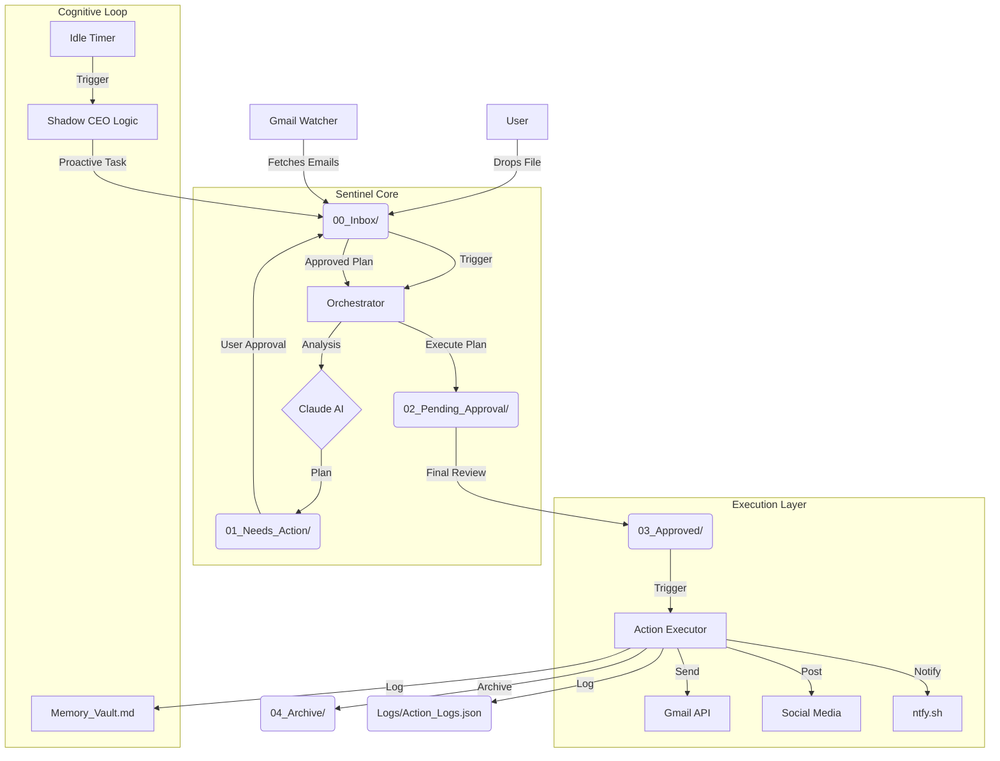

# 👁️ Vision 2026: Digital FTE Sentinel (Super-Agent)

**Current Status:** _Titanium Tier Operational_ 💎
**Version:** 4.0 (Proactive, Self-Healing, Mobile-Connected)
**Last Verified:** 2026-01-15

> "The first automated employee that thinks, acts, and notifies."

---

## 🏗️ Architecture

The Sentinel operates on a **Tri-Core Architecture**, connecting file system triggers to AI reasoning and external action execution.



---

## 🚀 Feature List

### 🥇 Gold Tier (Base Operation)
- **Autonomous Loop (`ralph_loop.py`)**: Continuous processing without manual restart.
- **Council of Experts**: 10+ Specialized AI Personas (Chief of Staff, CFO, etc.).
- **Self-Auditing**: Generates weekly "Amazon-style" memos analyzing its own performance.
- **Strict Compliance**: Enforces `Company_Handbook.md` rules (e.g., $100 spending limit).

### 💎 Super-Agent Upgrades (New!)
- **📱 Mobile Connectivity (`notify_boss.py`)**: Real-time push notifications to your phone for Urgent tasks or completions.
- **🧠 Long-Term Memory (`Memory_Vault.md`)**: Learns user preferences over time (e.g., "Boss likes emojis").
- **👻 Shadow CEO Mode**: If idle for >2 cycles, proactively reads `Vision_2026.md` and generates strategic improvements.
- **📧 Professional Email**: Auto-tags [URGENT], filters Spam, and creates **Drafts** for review instead of blind sending.

---

## 🛠️ Setup Guide

### Prerequisites
- Python 3.10+
- Google Cloud Credentials (`credentials.json`)
- DeepSeek/Gemini/Claude API Key

### Installation
1.  **Clone & Install Dependencies**:
    ```bash
    pip install -r requirements.txt
    ```

2.  **Configure Environment**:
    Create `.env`:
    ```ini
    GEMINI_API_KEY=your_key_here
    NTFY_TOPIC=kashan_sentinel_2026
    ```

3.  **Run the System**:
    ```bash
    # Start the Full System
    python run_fte.py
    ```

---

## 🔒 Security Disclosure

Your data security is paramount. The Sentinel is designed with privacy-first principles:

1.  **Local Execution**: All logic runs locally on your machine. No sensitive data is stored on external servers except deemed inputs.
2.  **Credential Safety**: 
    - API Keys are loaded from `.env` (Excluded from Git).
    - `credentials.json` (Google OAuth) is local-only.
    - `token.pickle` stores session tokens locally.
3.  **Human-in-the-Loop**: 
    - **Draft Mode**: Emails are strictly created as Drafts first.
    - **Approval Gate**: Critical actions require moving files to `03_Approved/`.
    - **Financial Cap**: Hard-coded triggers prevent high-value transactions without explicit override.

---

*Powered by Advanced Agentic Coding - Google Deepmind*
